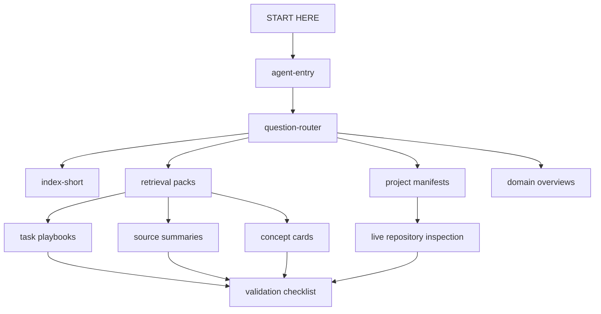

# Savage Vault Showcase

An agent-ready Obsidian knowledge system for turning a private research library into faster, safer, more decision-grade AI work.

This repository is the public showcase, not the vault itself. It demonstrates the architecture, routing model, metadata schema, governance layer, ingestion workflow, validation checks, and redacted examples behind a much larger private corpus.

The private vault powers coding agents, research agents, sports-business reasoning, marketing strategy, health/training analysis, finance work, baseball analytics, project context, and personal operating systems. This repo shows how that system is built without publishing the licensed sources, raw files, personal notes, or full third-party-derived summaries.

## Why this exists

Most personal knowledge bases are designed for a person wandering through notes.

This one is designed for agents working under context limits.

The goal is not “search my notes.” The goal is:

```text
classify the task
→ route to the right decision surface
→ open only the relevant notes
→ know what evidence is mature
→ inspect live sources when live state matters
→ validate before claiming done
```

That shift matters. Without routing and maturity metadata, a coding agent can grab a stale note, skip the live repo, and confidently make the wrong change. With the vault route, the agent has a map, a source hierarchy, and explicit hard stops.

## What the private system contains

At the time this showcase was prepared, the private vault contained:

| Layer | Count | Role |
|---|---:|---|
| Wiki pages | 1,088 | Total structured notes available to agents |
| Source summaries | 587 | Source-grounded extractions from papers, books, docs, and reports |
| Concept cards | 312 | Reusable decision rules synthesized from reviewed sources |
| Book overviews | 117 | Hubs for book-length sources and deep chapter/section notes |
| Operating/retrieval/overview pages | 36 | Agent entry points, retrieval packs, governance docs, validation reports |
| Project manifests | 18 | Repo-specific read-first maps for local project work |
| Raw source files | 259 | Private PDFs/EPUBs/source files, intentionally excluded here |

The corpus is not just stored; it is wired.

## What this showcase includes

- A public explanation of the vault architecture
- Agent access patterns for Codex, Claude Code, ChatGPT-style agents, and direct-file readers
- A redacted ingestion pipeline for books, papers, and web sources
- A metadata schema for source maturity and retrieval behavior
- Synthetic sample notes that show structure without exposing content
- A validation script that blocks obvious raw/private-source leakage
- A GitHub Actions workflow for showcase validation

## What this showcase does not include

- The real vault
- Raw PDFs, EPUBs, books, papers, or downloaded source files
- Personal notes, health notes, finance notes, journals, career details, or private project context
- Full source summaries derived from third-party works
- Anything intended to let someone reconstruct the private corpus

This boundary is the point. The portfolio artifact is the system design, not the redistribution of the underlying library.

## The architecture



The private vault uses several note classes:

| Type | Purpose |
|---|---|
| `overview` | Domain maps, retrieval packs, validation reports, operating surfaces |
| `source-summary` | Reviewed extraction from a paper, book, article, dataset, or official doc |
| `book-overview` | Hub note for a book-length source and its chapter/section notes |
| `concept` | Fast decision card synthesized from reviewed sources |
| `analysis` | Operational playbook or cross-source synthesis |
| `project-context-manifest` | Repo-specific map telling agents what to inspect first |

## Agent routing example

Before touching code in a local project, the agent is expected to route like this:

```text
START HERE
→ agent-entry
→ question-router
→ project-context-manifests
→ matching project manifest
→ coding-agent-operating-card
→ agent-access-coding-corpus
→ retrieval-pack-ai-engineering
→ relevant coding-agent playbook
→ live repo README / agent docs / config / source / tests
→ coding-agent-review-checklist
```

Two rules sit underneath that whole flow:

1. A project root is not a repository target. The exact repo must be named before code is modified.
2. Vault notes are retrieval context, not proof of current repo state. The live repository wins.

## Example retrieval packs

The private vault uses retrieval packs as task-specific launchpads. Examples include:

| Retrieval pack | What it routes |
|---|---|
| AI engineering | RAG, agent design, tool use, evals, coding-agent behavior, data systems, MLOps |
| Sports business and marketing | Sponsorship, brand growth, positioning, pricing, experiments, fan behavior |
| Baseball trade evaluation | Sabermetrics, scouting, WAR/FV, roster value, uncertainty |
| Health and training | Sleep, recovery, hypertrophy, strength, conditioning, wearable interpretation |
| Quantitative finance | Factor investing, systematic equity, expected returns, ranking models |
| Career | Resume/JD fit, labor-market evidence, career positioning, application strategy |

The important detail: agents do not start with broad search. They start with a route.

## Depth, not sludge

The ingestion model is intentionally deep where depth changes behavior.

For a book or paper, the private vault may create:

1. A hub note with source identity, scope, and chapter map
2. A high-value extraction note for the whole source
3. Targeted chapter/section notes where retrieval grain matters
4. Concept cards that become reusable decision rules
5. Route wiring into the relevant retrieval pack or playbook
6. Validation records so agents know the maturity level

Recent examples of “deep enough to change agent behavior” include:

| Area | Deep agent behavior added |
|---|---|
| Data contracts | Producer/consumer boundary, schema governance, rollout, compatibility |
| MLOps | Artifact identity, drift monitoring, inference contracts, rollback |
| Coding agents | Safe-change playbooks, validation gates, context budget discipline |
| Sports sponsorship | Objective → fit → activation → metric layer → causal evidence |
| Brand strategy | Positioning, sticky messages, shareability, staged experience design |

The vault avoids creating dozens of thin chapter notes just to look complete. The bar is whether a note gives the agent a sharper decision surface.

## Evidence maturity model

Every mature page carries metadata that tells an agent how it can be used:

```yaml
validation_status: reviewed
fidelity_status: source-checked
retrieval_priority: high
symbolic_role: evidence
evidence_lane: engineering
requires_review: false
approved_use: ["coding-agent-guidance"]
prohibited_use: ["substituting-for-live-repo-inspection"]
```

This lets the system distinguish:

- evidence vs. synthesis
- reviewed notes vs. legacy notes
- high-confidence source summaries vs. hypothesis generators
- routing pages vs. authority pages
- private context vs. live-state proof

## Validation and governance

The private vault has governance docs and validation passes for:

- required frontmatter
- unresolved wikilinks
- source-fidelity status
- raw-source references
- stale project manifests
- index drift
- retrieval-pack promotion rules
- claim conflicts
- high-stakes answer gates
- agent evaluation cases

This showcase includes a smaller public validation script:

```bash
python scripts/validate_showcase.py
```

It checks that the showcase stays sanitized and structurally coherent.

## Repository map

```text
.
├── docs/
│   ├── architecture.md
│   ├── agent-access.md
│   ├── ingestion-pipeline.md
│   ├── privacy-and-content-boundary.md
│   ├── validation-and-governance.md
│   └── sample-routing-transcript.md
├── samples/
│   ├── source-summary-redacted.md
│   ├── retrieval-pack-redacted.md
│   ├── project-manifest-redacted.md
│   └── operating-card-redacted.md
├── schemas/
│   └── frontmatter.schema.json
└── scripts/
    └── validate_showcase.py
```

## Design principles

- Route before search.
- Open the narrowest useful source.
- Treat notes as context, not live-state authority.
- Keep private and licensed source material private.
- Make uncertainty visible.
- Prefer explicit maturity metadata over vibes.
- Let concept cards be fast, but make source notes available when evidence matters.
- Never let an agent modify code before the exact repository and local conventions are known.

## Portfolio takeaway

This is a personal knowledge base evolved into an agent operating layer.

It is part library, part retrieval system, part governance model, part project memory, and part safety rail. The private corpus gives agents useful context; the routing and validation layers keep that context from becoming overconfident nonsense.

That is the thing worth showing.

