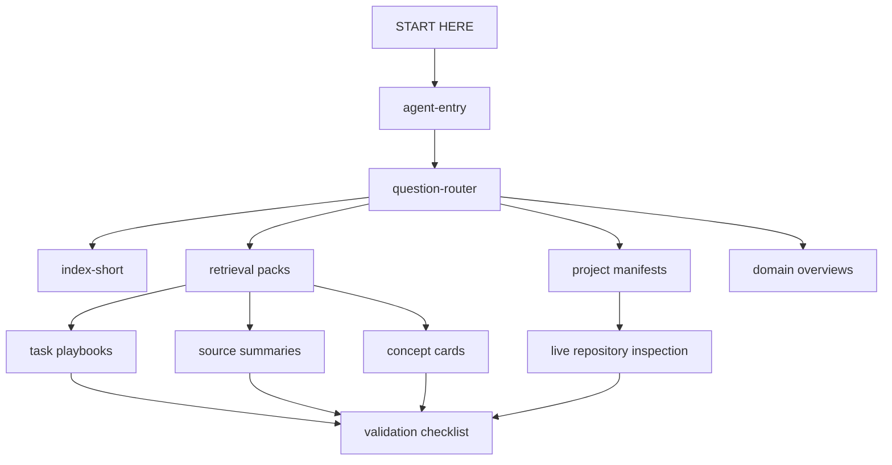

# Savage Vault Showcase

<p>
  
  
  
</p>

A sanitized look at the Obsidian vault I use as a working memory layer for coding agents, research, sports analysis, finance, health, and project work.

The real vault is private. This repo shows the operating model: how notes are structured, how agents find the right context quickly, how source quality is marked, and how the system avoids publishing raw books, papers, personal notes, or licensed material.

## The problem

Long-context agents are easy to impress and easy to mislead.

If I give an agent the whole vault, it wastes time and grabs stale or irrelevant material. If I give it nothing, it repeats generic advice. The useful middle ground is a routed corpus: small entry files, explicit task paths, reviewed source notes, and hard rules about when the vault is only context.

The vault is built around that middle ground.

```text
classify the request
→ pick the route
→ open the smallest useful set of notes
→ check whether the note is reviewed
→ inspect the live repo or source when current state matters
→ validate before calling the work done
```

## What sits behind this showcase

The private vault currently has:

| Layer | Count | What it does |
|---|---:|---|
| Wiki pages | 1,088 | Structured notes available to agents |
| Source summaries | 587 | Reviewed extractions from books, papers, docs, and reports |
| Concept cards | 312 | Short decision rules synthesized from reviewed material |
| Book hubs | 117 | Maps for book-length sources and deeper chapter notes |
| Operating / retrieval pages | 36 | Routers, retrieval packs, validation reports, and access guides |
| Project manifests | 18 | Repo-specific read-first files for local coding work |
| Raw source files | 259 | Private source files, excluded from this repo |

The point is not the count. The point is that the pieces are wired together.

## How agents use it

For a coding task, the route looks like this:

```text
START HERE
→ agent-entry
→ question-router
→ project-context-manifests
→ matching project manifest
→ coding-agent-operating-card
→ agent-access-coding-corpus
→ retrieval-pack-ai-engineering
→ task-specific playbook
→ live repo files
→ validation checklist
```

Two rules matter most:

1. A project root is not a repo target. The exact repository has to be named before code changes.
2. The vault is not proof of live state. If the question depends on current repo behavior, API behavior, dependency versions, prices, schedules, laws, or production state, the agent has to inspect the live source.

## What is included here

- Architecture docs
- Agent access pattern
- Ingestion workflow
- Public metadata schema
- Redacted sample notes
- Privacy/content boundary
- Lightweight validation script
- GitHub Actions check

## What is not included

- The real vault
- Raw PDFs, EPUBs, books, papers, or downloaded source files
- Personal notes
- Private project context
- Full source summaries derived from third-party works
- Anything that would let someone reconstruct the private corpus

That boundary is deliberate. The interesting part to show publicly is the system, not the library.

## Architecture



The main note types:

| Type | Purpose |
|---|---|
| `overview` | Domain map, retrieval pack, validation report, or operating surface |
| `source-summary` | Reviewed extraction from a source |
| `book-overview` | Hub for a book-length source |
| `concept` | Short reusable decision rule |
| `analysis` | Playbook or cross-source synthesis |
| `project-context-manifest` | Repo-specific read-first map |

## Retrieval packs

The private vault uses retrieval packs instead of broad search. A few examples:

| Pack | Routes |
|---|---|
| AI engineering | RAG, coding agents, evals, tool use, data systems, MLOps |
| Sports business and marketing | Sponsorship, brand growth, positioning, pricing, experiments |
| Baseball trade evaluation | WAR, FV, scouting, roster value, uncertainty |
| Health and training | Sleep, recovery, strength, conditioning, wearable interpretation |
| Quantitative finance | Factor investing, ranking models, calibration |
| Career | Resume/JD fit, labor-market evidence, positioning |

## Ingestion depth

I do not create chapter notes just to say every chapter was covered.

A book or paper gets deeper treatment when the extra grain changes how an agent behaves. A typical source can produce:

1. a hub note;
2. a whole-source extraction;
3. targeted chapter or section notes;
4. short concept cards;
5. links from the relevant retrieval pack or playbook;
6. validation checks for metadata and links.

Recent deep passes added routes for data contracts, schema evolution, MLOps, model drift, model artifact contracts, sponsorship evaluation, positioning, sticky messages, shareability, and staged experience design.

## Metadata that keeps agents honest

Mature notes carry fields like:

```yaml
validation_status: reviewed
fidelity_status: source-checked
retrieval_priority: high
symbolic_role: evidence
evidence_lane: engineering
requires_review: false
approved_use: ["coding-agent-guidance"]
prohibited_use: ["substituting-for-live-repo-inspection"]
```

This is not ceremony. It tells an agent whether a note is evidence, a route, a synthesis, a hypothesis, or just legacy context.

## Validation

The private vault has deeper checks for unresolved links, missing metadata, source-fidelity status, stale manifests, index drift, claim conflicts, and high-stakes answer gates.

This public repo includes a smaller guardrail:

```bash
python scripts/validate_showcase.py
```

It checks that the showcase stays structurally coherent and does not accidentally grow a raw-source directory or obvious private-source links.

## Repository map

```text
.
├── docs/
│   ├── architecture.md
│   ├── agent-access.md
│   ├── ingestion-pipeline.md
│   ├── privacy-and-content-boundary.md
│   ├── validation-and-governance.md
│   └── sample-routing-transcript.md
├── samples/
│   ├── source-summary-redacted.md
│   ├── retrieval-pack-redacted.md
│   ├── project-manifest-redacted.md
│   └── operating-card-redacted.md
├── schemas/
│   └── frontmatter.schema.json
└── scripts/
    └── validate_showcase.py
```

## Design principles

- Route before search.
- Open fewer notes, but better ones.
- Treat vault notes as context, not authority.
- Keep private and licensed material private.
- Make uncertainty visible.
- Prefer reviewed metadata over vibes.
- Inspect the live repo before changing code.

This is the piece I wanted to show: a personal knowledge base turned into an operating layer for agents, without pretending the private library itself belongs on GitHub.

