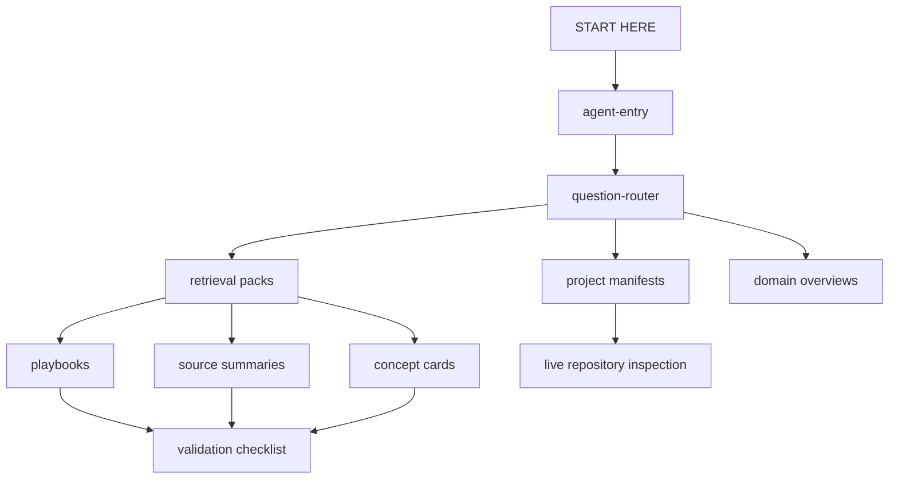

# Architecture

The private vault is an Obsidian knowledge system designed for both human reading and agent retrieval.

The design goal is not “store everything.” The design goal is “help an agent find the right decision surface quickly, then know what not to overclaim.”

## System shape



## Main note types

| Type | Purpose |
|---|---|
| `overview` | Domain map, operating surface, retrieval pack, or validation report |
| `source-summary` | Source-grounded extraction from a paper, book, article, or dataset |
| `book-overview` | Hub for a book-length source and its chapter/section notes |
| `concept` | Reusable decision rule synthesized from reviewed sources |
| `analysis` | Operational playbook or synthesis note |
| `project-context-manifest` | Agent read-first map for a local project |

## Why routing beats search

Broad search is slow and noisy. The vault uses small entry points that classify the task before opening content.

For example, a data-pipeline code change should not search the entire corpus for “data.” It should route to:

```text
coding-agent-operating-card
→ project-context-manifests
→ retrieval-pack-ai-engineering
→ coding-agent-data-system-playbook
→ coding-agent-data-ml-contracts-playbook, if relevant
→ live repo schemas/tests/config
```

That makes agent behavior faster and safer.

## Authority model

Vault notes are retrieval context, not live-state authority.

An agent may use the vault to learn how to think about a codebase, sponsorship claim, research question, or project. But it must inspect the live source of truth before claiming current repo behavior, API behavior, law, price, schedule, dependency version, or production state.

